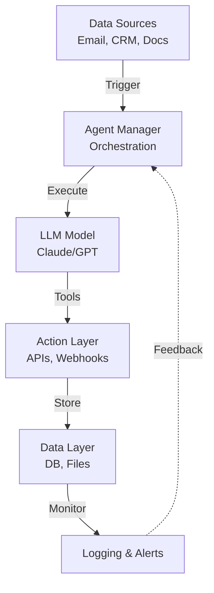

# KI-Agent Architecture

### Autonomous Systems für Production-Grade Automation

---

## System Overview



---

## Layer 1: Trigger & Input

**How agents get started:**

- ⏰ **Time-based:** Every morning at 8 AM
- 📧 **Event-based:** New email arrives
- 🔔 **Webhook:** API call from external system
- 📊 **Database:** New records in CRM
- 🎯 **Manual:** Human-initiated

**Example Flow:**
```
Email received → n8n webhook → Agent wakes up → Process starts
```

---

## Layer 2: Agent Manager (n8n)

**Orchestration Engine**

```javascript
{
  "workflow": "process_invoices",
  "steps": [
    { "fetch_unprocessed_pdfs": {} },
    { "call_agent": { "model": "claude" } },
    { "validate_output": {} },
    { "human_review": { "required": true } },
    { "post_to_accounting": {} }
  ],
  "error_handling": "retry_3_times_then_alert"
}
```

---

## Layer 3: LLM Model

**The Brain**

### Model Selection
```
├─ Claude Opus (Complex reasoning)
├─ GPT-4 (Balanced)
├─ Gemini (Multimodal)
└─ Local Llama (Privacy-first)
```

### Context Window Management
```
[System Prompt: 1500 tokens]
[Few-Shot Examples: 2000 tokens]
[Current Data: 3000 tokens]
────────────────────────
[Available: ~93500 tokens]
```

---

## Layer 4: Tools & Actions

**What agents can DO:**

| Tool | Purpose | Rate Limit |
|------|---------|------------|
| Gmail API | Read/send emails | 10req/sec |
| n8n HTTP | Call webhooks | Unlimited |
| File Storage | Upload/download | 1GB/day |
| Database | CRUD operations | 100req/sec |
| PDF Parser | Extract text | 10 docs/min |

---

## Layer 5: Data Storage & Persistence

**Where results live:**

```
┌─────────────────────────────────┐
│   PostgreSQL (Structured)        │
│   ├─ Agent Runs                  │
│   ├─ Processing Logs             │
│   └─ Error Tracking              │
│                                  │
│   Redis Cache (Performance)      │
│   ├─ Session State               │
│   └─ Rate Limiting               │
│                                  │
│   S3 / Local Storage (Files)     │
│   ├─ Input Documents             │
│   ├─ Generated Output             │
│   └─ Backups                      │
└─────────────────────────────────┘
```

---

## Human-in-the-Loop (Critical!)

**Where humans approve:**

```
Agent Decision → Confidence Score?
                  │
                  ├─ >95%: Execute automatically
                  ├─ 70-95%: Queue for review
                  └─ <70%: Flag + escalate
```

**Review Dashboard:**
```
[Pending Approvals: 3]
├─ Invoice #2024-001 (89% confidence)
├─ Email Draft to Client (78%)
└─ Database Update (82%)

[Approved Last Hour: 47]
[Rejected: 2]
```

---

## Error Handling Strategy

```
┌─ API Timeout
│  └─ Retry (exponential backoff)
│     └─ Max 3 attempts
│        └─ Alert if still failing
│
├─ LLM Hallucination
│  └─ Validate against rules
│     └─ Use alternative model
│        └─ Escalate if unresolved
│
└─ Missing Data
   └─ Retry with fallback
      └─ Request human input
```

---

## Monitoring & Observability

### Key Metrics

```javascript
{
  "agent_runs": {
    "total": 1250,
    "success": 1203,
    "failed": 47,
    "success_rate": "96.2%"
  },
  "latency_p99": "2.3s",
  "cost_per_run": "$0.12",
  "human_review_rate": "18%",
  "approval_rate": "94%"
}
```

### Alerts (Automatic)
- ⚠️ Error rate >5%
- 🔴 Latency >10 seconds
- 💸 Cost threshold exceeded
- 📉 Success rate dropping

---

## Security & Compliance

### Data Protection

```
User Data
├─ In Transit: TLS 1.3
├─ At Rest: AES-256
├─ Access: IAM roles
└─ Audit: Every operation logged
```

### Compliance Checklist
- ✅ DSGVO-ready (data minimization)
- ✅ No data to 3rd-party LLMs
- ✅ Encryption by default
- ✅ Audit trail immutable
- ✅ Right to deletion (30 days)

---

## Performance Tuning

### Optimization Techniques

1. **Batching** – Process 100 items/batch (not 1 by 1)
2. **Caching** – Store repeated queries (Redis)
3. **Async** – Non-blocking operations
4. **Scaling** – Horizontal: multiple agent instances

### Benchmarks
```
Single Agent Throughput:
├─ Emails: 500/hour
├─ Invoices: 100/hour (PDF parsing slower)
├─ DB Updates: 10,000/hour
└─ Latency p99: 2.3 seconds
```

---

## Deployment Architecture

```
┌────────────────────────────────────┐
│     Cloud Kubernetes Cluster       │
├────────────────────────────────────┤
│  ┌─────────────────────────────┐   │
│  │  Agent Service (Replicas: 3) │   │
│  │  ├─ Processing Pod           │   │
│  │  ├─ Storage Pod              │   │
│  │  └─ Cache Pod                │   │
│  └─────────────────────────────┘   │
│                                     │
│  ┌─────────────────────────────┐   │
│  │  Monitoring & Logging       │   │
│  │  ├─ Prometheus              │   │
│  │  ├─ Grafana Dashboards      │   │
│  │  └─ ELK Stack               │   │
│  └─────────────────────────────┘   │
└────────────────────────────────────┘
```

---

## Cost Model

### Per-Agent Pricing
```
LLM Calls:      $0.08 per execution
Storage:        $0.001 per GB
API Calls:      Included (via n8n)
Monitoring:     Included
──────────────
Estimated:      $0.10-0.20 per run
```

### ROI Example
```
Email Agent (500 emails/day):
├─ Cost: 500 × $0.10 = $50/day
├─ Time saved: 5 hours/day × €30/h = €150/day
├─ Net benefit: €100/day
└─ Payback period: 9 days
```

---

## Roadmap: Next 6 Months

**Q2 2026:**
- [ ] Multi-model fallback (GPT→Claude→Gemini)
- [ ] Advanced RAG (semantic search over docs)
- [ ] Custom fine-tuning pipeline

**Q3 2026:**
- [ ] Voice input/output agents
- [ ] Real-time streaming responses
- [ ] Agent-to-Agent communication

**Q4 2026:**
- [ ] Self-improving agents (feedback loops)
- [ ] Predictive monitoring & auto-scaling
- [ ] Native DSGVO compliance certifications

---

## Questions?

**Technical Support:**
📧 technical@raspb.de

**Documentation:**
🔗 docs.raspb.eu/agents

**GitHub:**
🐙 github.com/raspb-webservices/agent-examples

---

## Appendix: Agent Configuration

```yaml
# Full Agent Config
agent:
  name: "Invoice Processor"
  model: "claude-opus"
  model_fallback: ["gpt-4", "gemini-pro"]
  
  context:
    system_prompt: "You are an accounting agent..."
    few_shot_examples: 5
    max_tokens: 4096
  
  tools:
    - name: "pdf_extract"
      rate_limit: "10/min"
    - name: "db_write"
      rate_limit: "100/sec"
  
  human_review:
    required: true
    threshold_confidence: 0.85
  
  monitoring:
    alert_on_error: true
    log_all_runs: true
```
