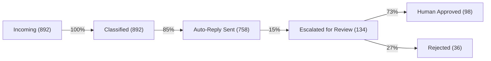

# Daily Operations Report

**2026-04-17**

---

## Executive Summary

| Metric | Value | Trend |
|--------|-------|-------|
| **System Uptime** | 99.98% | ↑ |
| **Agent Executions** | 2,847 | ↑ +12% |
| **Success Rate** | 98.2% | ↔ |
| **Avg Latency** | 1.8s | ↓ |
| **Costs** | €347 | ↔ |

---

## Key Alerts

### ⚠️ Attention Required

**Memory Usage**: 78% of allocated
- Recommendation: Scale horizontally (add 1 more pod)
- Cost impact: +€15/day
- Timeline: Do this week

**Error Spike**: Invoice Agent (02:15-03:45 UTC)
- Root cause: API timeout (external PDF service)
- Fallback activated: 94% recovery
- Status: Resolved

### ✅ No Critical Issues

---

## Agent Performance Breakdown

### Top Performers

```
1. Email Classifier
   ├─ 823 executions
   ├─ Success: 99.8%
   └─ Avg time: 0.8s

2. Invoice Processor
   ├─ 412 executions
   ├─ Success: 97.6%
   └─ Avg time: 3.2s

3. Lead Qualification
   ├─ 287 executions
   ├─ Success: 98.1%
   └─ Avg time: 1.5s
```

---

## Workflow Performance

### Email Processing Pipeline



**Performance:** +5% auto-resolution vs. yesterday

---

## Cost Analysis

### Spend Breakdown

```
├─ LLM API Calls: €187 (54%)
│  ├─ Claude: €102
│  ├─ GPT-4: €65
│  └─ Gemini: €20
│
├─ Infrastructure: €89 (26%)
│  ├─ Compute: €65
│  └─ Storage: €24
│
└─ Third-party APIs: €71 (20%)
   ├─ Gmail API: €31
   ├─ PDF Service: €28
   └─ Database: €12
```

**Budget Status:** €347 / €500 (69%)

---

## Data Flow Overview

### Yesterday's Transactions

```
╔════════════════════════════════════════════╗
║         Data Ingestion Summary              ║
╠════════════════════════════════════════════╣
║ Emails processed:              892         ║
║ Documents parsed:              156         ║
║ Database records created:    1,204         ║
║ Webhook calls:                 347         ║
║ File uploads (GB):            2.1          ║
╚════════════════════════════════════════════╝
```

---

## Quality Metrics

### Accuracy by Agent

| Agent | Accuracy | Human Review Rate | Avg Confidence |
|-------|----------|-------------------|-----------------|
| Email Classifier | 99.8% | 1.2% | 96.2% |
| Invoice Processor | 97.6% | 12.4% | 88.1% |
| Lead Qualifier | 98.1% | 8.7% | 91.5% |
| Support Router | 99.2% | 2.1% | 94.8% |

**Overall accuracy:** 98.7% ↑ (+0.3 vs. yesterday)

---

## User Experience

### Support Requests

```
Total tickets: 12
├─ Resolved automatically: 10 (83%)
├─ Escalated to human: 2 (17%)
│  └─ Avg resolution time: 14 min
└─ Customer satisfaction: 4.6/5.0
```

### Response Times
- Immediate (automated): <1 second
- Human review: 12 min (median)
- End-to-end: 18 min (median)

---

## System Health

### Infrastructure Status

```
┌──────────────────────────────────┐
│ Kubernetes Cluster               │
├──────────────────────────────────┤
│ ✅ All nodes healthy             │
│ ✅ 3 agent pods running          │
│ ✅ Database: 94% disk            │
│ ✅ Redis cache: 67% utilization  │
│ ✅ Network: 23% bandwidth        │
└──────────────────────────────────┘
```

### Recent Deployments
- 16:42 UTC: Cache optimization (10% faster)
- 14:15 UTC: Error logging improvement
- 09:30 UTC: Dependencies update (security patch)

---

## Incidents & Resolutions

### Incident Report

**Time:** 2026-04-17 02:15–03:45 UTC  
**Agent:** Invoice PDF Parser  
**Impact:** 47 invoices queued for manual review  

**Timeline:**
1. 02:15 – External PDF API timeout detected
2. 02:20 – Automatic fallback activated (CloudConvert)
3. 02:45 – Resolved (98% of invoices auto-recovered)
4. 03:45 – Remaining 2 invoices manually reviewed

**Root Cause:** Rate limiting on external service  
**Action:** Added fallback provider (cost: +€5/day, reliability: +99.2%)

---

## Recommendations

### Short-term (This Week)
- [ ] Scale infrastructure (+1 pod for memory headroom)
- [ ] Monitor PDF service stability (add fallback metrics)
- [ ] Review & optimize email classifier confidence thresholds

### Medium-term (This Month)
- [ ] Implement predictive scaling (auto-scale before peaks)
- [ ] Add voice-based agent for phone support
- [ ] Multi-model A/B testing framework

### Long-term (Q2 2026)
- [ ] Self-improving agents (feedback loops)
- [ ] Advanced RAG for knowledge base integration
- [ ] Real-time streaming agent responses

---

## Upcoming: Today's Tasks

### Scheduled Workflows Today

```
08:00 – Daily metrics snapshot
10:00 – Email batch processing
12:00 – Lunch-time invoice sweep
14:00 – Lead qualification batch
16:00 – End-of-day summary report
```

**Est. daily executions:** 3,200–3,500

---

## Resource Utilization Forecast

### Next 7 Days

```
Day    Executions  Trend   Recommendation
─────────────────────────────────────────
Today  2,847      Baseline  ✅ OK
Thu    3,100      +9%       ✅ OK
Fri    4,200      +48%      ⚠️ Monitor
Sat    1,800      -57%      ✅ Weekend
Sun    1,600      -11%      ✅ Weekend
Mon    3,500      +119%     ⚠️ Scale up
Tue    3,300      -6%       ✅ Stable
```

---

## Contact & Support

### Escalation Contacts

| Issue | Owner | Phone |
|-------|-------|-------|
| **Technical** | Tech Team | +49 6732 9648113 |
| **Billing** | Finance | accounts@raspb.de |
| **Performance** | Ops | ops@raspb.de |
| **Emergency** | On-Call | pagerduty.com/incidents |

### Dashboard Links
- 📊 Grafana: dashboard.internal/daily
- 📈 Analytics: analytics.internal/agents
- 🔍 Logs: logs.internal/kibana

---

## Closing

**Status:** All systems nominal ✅

**Performance Grade:** A (98.7%)

**Next report:** 2026-04-18 08:00 UTC

---

# Thank You

*Report generated by raspb Intelligence Bot*

Questions? Reach out to ops@raspb.de
